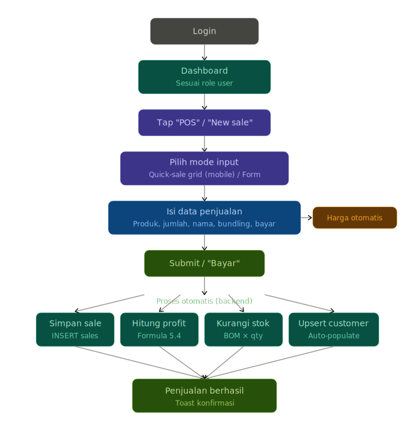

# PRD: Parissa POS — Sistem Manajemen Bisnis Dessert & Minuman Premium

| Field | Value |
|-------|-------|
| **PRD Version** | v2.1 |
| **Last Updated** | 10 April 2026 |
| **Author** | Rico (Owner) + Claude (AI Assistant) |
| **Status** | Draft — Awaiting Final Review |
| **Repository** | https://github.com/ricobowo/Parissa.git |
| **Data Source** | Airtable Base "Parissa" (app8ia1T8kY7PqeHR) |

---

## Changelog

| Version | Date | Changes |
|---------|------|---------|
| v1.0 | 9 Apr 2026 | Initial PRD — 10 sections, 53 functional requirements |
| v2.0 | 9 Apr 2026 | Major update: flexible roles, verified formulas, diagrams (User Flow, C4, Sequence, ERD), bilingual support, working rules, timeline per phase, semua fitur tambahan masuk Phase 1, WhatsApp notification deprioritized, design reference dari Airtable screenshots |
| v2.1 | 10 Apr 2026 | Minor update: Design Considerations disesuaikan mengikuti Notion |

---

## 1. Introduction/Overview

Parissa adalah bisnis dessert dan minuman premium berbasis di Bandung yang menjual Pannacotta (Vanilla, Earl Grey, Bundling) dan Fresh Creamy drinks (Earl Grey, Matcha, Lotus). Saat ini seluruh operasional dikelola menggunakan Airtable dengan 9 tabel yang saling terelasi.

**Masalah utama:**
- Input penjualan di Airtable lambat (2-3 menit per transaksi) — terlalu banyak field required
- Tidak ada dashboard visual real-time yang optimal di mobile
- Kalkulasi profit memerlukan navigasi ke tabel terpisah dengan formula rentan error
- Tidak ada notifikasi otomatis saat stok bahan menipis

**Solusi:** Membangun aplikasi POS web responsif (mobile + desktop) khusus untuk Parissa.

---

## 2. Goals

1. Mempercepat input penjualan — target < 30 detik per transaksi
2. Menampilkan profit real-time tanpa navigasi manual
3. Mencegah kehabisan bahan baku — notifikasi WhatsApp (prioritas akhir Phase 1)
4. Memberikan insight bisnis — laporan bulanan dengan grafik tren
5. Mendukung kerja tim — role-based access yang fleksibel
6. Responsif di semua perangkat — mobile-first
7. Bilingual — UI dalam Bahasa Indonesia dan Bahasa Inggris (switchable)
8. Customer intelligence — database pelanggan dan tracking repeat buyer

---

## 3. User Stories

### Owner (Rico)
- US-001: Melihat dashboard ringkasan harian (revenue, profit, unpaid, jumlah transaksi, distribusi per produk)
- US-002: Melihat laporan profit per produk dalam periode tertentu
- US-003: Melihat laporan bulanan dengan grafik tren penjualan
- US-004: Export data ke Excel
- US-005: Mengelola role dan hak akses tim secara fleksibel
- US-006: Menerima notifikasi WhatsApp saat stok menipis
- US-007: Melihat daftar pelanggan beserta histori pembelian
- US-008: Melihat rekomendasi harga jual berdasarkan target margin
- US-009: Melihat batch mendekati expiry di kalender visual
- US-010: Mencatat produk terbuang (waste/spoilage)

### Staff Kasir
- US-011: Input penjualan cepat dari HP via quick-sale grid
- US-012: Melihat daftar pre-order yang belum diambil
- US-013: Mengubah status pembayaran "Belum" ke "Sudah"

### Staff Produksi
- US-014: Mencatat batch produksi (produk, jumlah, expiry)
- US-015: Melihat stok bahan baku saat ini
- US-016: Mencatat pembelian/restock bahan baku

### Admin Keuangan
- US-017: Melihat semua transaksi beserta status pembayaran
- US-018: Melihat riwayat transaksi lengkap (audit trail)
- US-019: Melihat histori pembelian bahan baku

---

## 4. Functional Requirements

### 4.1 Autentikasi & Role Management (Fleksibel)
- FR-001: Login dengan email dan password
- FR-002: Role management fleksibel — owner bisa buat role baru, edit nama, definisikan permissions. Role TIDAK di-hardcode.
- FR-003: Default roles: Owner, Kasir, Produksi, Admin Keuangan. Bisa diubah/ditambah/dihapus.
- FR-004: Permission matrix per modul (Dashboard, POS, Produk, Resep, Stok, Batching, Pembelian, Laporan, Pelanggan, Pengaturan)
- FR-005: Owner bisa manage user accounts dan assign roles

### 4.2 Dashboard
Referensi: Screenshot Airtable "Sales Performance & Gross Profit Overview"

- FR-006: 6 kartu metrik: Total Revenue, Total Cost, Total Profit, Unpaid, Total Purchase Amount, Total Transactions
- FR-007: Bar chart distribusi penjualan per produk
- FR-008: Donut chart bundling vs non-bundling
- FR-009: Stacked bar chart "Sales Revenue Over Time" (revenue per hari, warna per produk)
- FR-010: Filter: status bayar dan produk
- FR-011: Tabel detail transaksi Paid dan Unpaid terpisah
- FR-012: Responsif — scroll vertikal di mobile, grid di desktop

### 4.3 Input Penjualan (POS)
Referensi: Screenshot form "Pembelian" Airtable

**Required fields (langsung berkaitan dengan data penjualan):**
- Nama Pembeli (text) — REQUIRED
- Tanggal (date, default hari ini) — REQUIRED
- Produk (dropdown/grid) — REQUIRED
- Jumlah (number) — REQUIRED
- Bundling (Yes/No) — REQUIRED
- Status Bayar (Sudah/Belum) — REQUIRED

**Optional fields:**
- Menu detail (textarea) — OPTIONAL
- Topping (textarea) — OPTIONAL
- Tipe Penjualan (Direct/Pre-order) — OPTIONAL, default Direct
- Tanggal Pre-order (date) — OPTIONAL, muncul jika tipe = Pre-order
- Catatan (textarea) — OPTIONAL

- FR-013: Form dengan field required/optional seperti di atas
- FR-014: Produk dari Finished Products aktif (6 produk). Harga otomatis terisi
- FR-015: Bundling dinamis — tidak terbatas Pannacotta 3-pack
- FR-016: Quick-sale mode mobile — grid 2x3 kartu produk, tap to add, (+/-)
- FR-017: Harga otomatis: Price = Selling_Price x Amount
- FR-018: Profit dihitung real-time setelah submit (Formula Section 5)

### 4.4 Manajemen Produk
- FR-019: Daftar produk dengan harga, cost, profit margin
- FR-020: CRUD produk (soft delete)
- FR-021: Setiap produk terhubung ke Recipe/BOM

### 4.5 Resep / BOM
- FR-022: Halaman resep per produk: bahan, jumlah, cost per bahan, total cost per porsi
- FR-023: Owner bisa edit komposisi. Perubahan auto-update cost dan margin
- FR-024: Pricing Calculator — input target margin, output harga jual minimum

### 4.6 Stock & Bahan Baku (Basic)
- FR-025: Daftar bahan baku: nama, qty, satuan, status (Aman/Menipis/Habis), min level
- FR-026: Status otomatis berdasarkan formula Section 5
- FR-027: Stok auto-berkurang saat penjualan (BOM x qty terjual)
- FR-028: Stok auto-bertambah saat restock

Note: Manajemen stok lanjutan (forecasting, auto-PO) masuk Next Phase.

### 4.7 Batching (Produksi)
- FR-029: Catat batch: produk, jumlah, tanggal produksi, expiry, status, catatan
- FR-030: Batch creation auto-deduct stok bahan sesuai BOM
- FR-031: Expiry Tracker — kalender visual, H-3 dan H-1 ditandai warna
- FR-032: Alert batch expired di dashboard

### 4.8 Purchase / Restock
- FR-033: Catat pembelian: bahan, jumlah, harga, supplier, tanggal
- FR-034: Cost per unit auto-calculated
- FR-035: Auto-update stock setelah restock
- FR-036: Histori pembelian dengan filter

### 4.9 Laporan Profit
- FR-037: Total Revenue (hanya "Sudah"), Total Cost, Total Profit
- FR-038: Filter: periode, produk, status bayar
- FR-039: Profit margin per produk

### 4.10 Laporan Bulanan & Grafik Tren
- FR-040: Bar, line, pie chart
- FR-041: Compare antar bulan
- FR-042: Metrik ringkasan: total revenue, growth %, produk terlaris

### 4.11 Riwayat Transaksi (Audit Trail)
- FR-043: Semua transaksi tersimpan, searchable, filterable. Soft delete only.
- FR-044: Setiap perubahan tercatat (timestamp + user)

### 4.12 Export ke Excel
- FR-045: Tombol Export .xlsx di semua halaman laporan
- FR-046: Format currency Rupiah, sesuai filter aktif

### 4.13 Customer Database
- FR-047: Auto-populate dari nama pembeli di transaksi
- FR-048: Halaman pelanggan: nama, total txn, total spending, produk favorit, last purchase
- FR-049: Tandai pelanggan repeat sebagai "VIP" atau label kustom

### 4.14 Waste / Spoilage Tracking
- FR-050: Catat produk terbuang: produk, jumlah, alasan, tanggal
- FR-051: Waste cost auto-calculated, diperhitungkan dalam profit

### 4.15 Daily Production Planner
- FR-052: Rekomendasi batch berdasarkan avg penjualan 7 hari + pre-order
- FR-053: Tampil di dashboard staff produksi

### 4.16 Simple CRM — Follow-up Pembayaran
- FR-054: Transaksi "Belum" > 3 hari = "Overdue" (highlight)
- FR-055: Tandai "Sudah difollow-up" atau "Bad debt"

### 4.17 PWA
- FR-056: Installable via "Add to Home Screen"
- FR-057: Service worker untuk caching

### 4.18 Pre-Order
- FR-058: Daftar pre-order: pembeli, produk, tanggal pesan, tanggal ambil, status
- FR-059: Delivered = tercatat di laporan penjualan
- FR-060: Pengiriman via Gosend/Grabsend — tidak perlu tracking internal

### 4.19 Bilingual (ID/EN)
- FR-061: Semua UI (label, placeholder, notifikasi, error) dalam ID dan EN
- FR-062: Toggle bahasa di header/settings, tersimpan di profil user
- FR-063: Default: Bahasa Indonesia

### 4.20 Notifikasi WhatsApp (PRIORITAS AKHIR Phase 1)
- FR-064: Kirim WA saat stok "Menipis" atau "Habis"
- FR-065: Isi: nama bahan, qty tersisa, min level, saran beli
- FR-066: Max 1x per hari per bahan
- FR-067: Via Fonnte (gratis)

---

## 5. Formulas & Calculation Logic

PENTING: Semua formula dikaji ulang dan ditulis ulang — TIDAK langsung dari Airtable.

### 5.1 Harga Penjualan
```
IF is_bundling AND bundling_price EXISTS:
    sale_price = bundling_price × amount
ELSE:
    sale_price = selling_price × amount
```

### 5.2 Cost Per Unit (dari BOM)
```
total_batch_cost = SUM(quantity_used[i] × cost_per_unit_ingredient[i]) untuk semua bahan i
cost_per_unit = total_batch_cost / pcs_per_batch
```

### 5.3 Cost Per Unit Bahan Baku
```
cost_per_unit_ingredient = purchase_price / packaging_size
```

### 5.4 Profit Per Transaksi
```
IF payment_status == "Sudah":
    total_revenue = sale_price
    total_cost = cost_per_unit × amount
    total_profit = total_revenue - total_cost
ELSE:
    total_revenue = 0
    total_cost = cost_per_unit × amount
    total_profit = 0 - total_cost
```

### 5.5 Profit Margin Per Produk
```
profit_margin_pct = ((selling_price - cost_per_unit) / cost_per_unit) × 100
```

### 5.6 Status Stok
```
IF qty_available <= minimum_stock_level:       → "Habis" (MERAH)
ELSE IF qty_available <= (2 × min_stock):      → "Menipis" (KUNING)
ELSE:                                          → "Aman" (HIJAU)
```

### 5.7 Cost Per Unit Pembelian
```
cost_per_unit_purchase = price_paid / qty_purchased
```

### 5.8 Saran Jumlah Pembelian (Notifikasi WA)
```
suggested_qty = (avg_daily_usage_30d × 7) - qty_available
IF suggested_qty < 0: suggested_qty = 0
```

### 5.9 Waste Cost
```
waste_cost = waste_quantity × cost_per_unit
adjusted_profit = profit_from_sales - total_waste_cost
```

### 5.10 Daily Production Recommendation
```
recommended = CEIL((avg_sales_7d + pending_preorders - current_stock) / pcs_per_batch)
IF recommended < 0: recommended = 0
```

### 5.11 Pricing Calculator
```
min_selling_price = cost_per_unit / (1 - target_margin/100)
```

---

## 6. Non-Goals (Out of Scope)

**Tidak termasuk sama sekali:**
1. Integrasi marketplace (GoFood, GrabFood, Shopee)
2. Payment gateway online (QRIS, auto-transfer)
3. Loyalty program / membership
4. Multi-outlet
5. Aplikasi native mobile (PWA cukup)
6. Integrasi akuntansi (Jurnal.id, Accurate)
7. Barcode/QR scanning
8. Tracking pengiriman internal
9. Manajemen supplier

**Masuk Next Phase:**
1. Manajemen stok lanjutan (forecasting, auto-PO)
2. Laporan analitik lanjutan (cohort, CLV)
3. Fitur retur/refund
4. Multiple payment method tracking detail

---

#7. Design Considerations
7.1 Filosofi Desain
Minimalis seperti Notion — tampilan bersih, hitam putih, tipografi sebagai elemen utama. Tidak ada warna berlebihan, tidak ada dekorasi yang tidak perlu. Warna hanya digunakan untuk fungsi (status, alert, aksi), bukan untuk estetika.
Prinsip utama:

Content-first — konten adalah raja, UI hanya wadah. Tidak ada elemen visual yang bersaing dengan data.
Monokrom sebagai default — seluruh UI menggunakan skala hitam-putih-abu. Warna hanya muncul di tempat yang memiliki makna fungsional (badge status, alert stok, tombol aksi utama).
Whitespace yang cukup — biarkan elemen bernapas. Padding dan margin yang generous.
Tipografi hierarkis — ukuran dan ketebalan font yang jelas membedakan heading, body, dan caption tanpa perlu warna.
Kode fleksibel — semua warna didefinisikan sebagai CSS variables / design tokens di satu file. Mengubah seluruh tampilan cukup edit satu file konfigurasi, tanpa menyentuh komponen.

7.2 Sistem Warna (Design Tokens)
Semua warna didefinisikan sebagai CSS variables di satu file (globals.css atau theme.ts). Komponen tidak boleh hardcode warna — hanya referensi ke token.
css:root {
  /* --- Base (monokrom) --- */
  --color-bg:          #FFFFFF;
  --color-bg-secondary:#F7F7F5;    /* abu sangat muda, untuk card/surface */
  --color-bg-hover:    #F0F0EE;
  --color-border:      #E5E5E3;
  --color-text:        #1A1A1A;
  --color-text-secondary: #6B6B6B;
  --color-text-tertiary:  #9B9B9B;

  /* --- Aksen fungsional (hanya untuk status/aksi) --- */
  --color-accent:      #2383E2;    /* tombol utama, link */
  --color-success:     #0F7B0F;    /* status "Sudah", stok "Aman" */
  --color-warning:     #D9730D;    /* stok "Menipis", overdue */
  --color-danger:      #E03E3E;    /* stok "Habis", error */

  /* --- Dark mode (opsional, nanti) --- */
  /* Cukup override variabel di atas dalam media query */
}
Aturan penggunaan warna:

Latar belakang halaman: --color-bg
Latar belakang card/panel: --color-bg-secondary
Teks utama: --color-text
Teks pendukung: --color-text-secondary
Border dan garis pemisah: --color-border
Warna aksen hanya untuk: tombol utama, badge status bayar, indikator stok, link
Tidak ada warna untuk header, sidebar, atau navigasi — semua hitam/putih/abu

7.3 Tipografi
Satu font family saja. Hierarki dibuat dari ukuran dan ketebalan, bukan warna.
Font family : Inter (atau system font stack)
Heading 1   : 24px, semibold (600)    → judul halaman
Heading 2   : 18px, semibold (600)    → judul section
Heading 3   : 14px, medium (500)      → label grup
Body         : 14px, regular (400)     → teks umum, tabel
Caption      : 12px, regular (400)     → keterangan, timestamp
Monospace    : 13px, JetBrains Mono    → angka Rupiah, kode
7.4 Komponen UI
Semua komponen menggunakan shadcn/ui (sudah minimalis by default) dengan kustomisasi minimal:

Card — border 1px --color-border, radius 8px, tanpa shadow. Latar --color-bg atau --color-bg-secondary.
Button primary — background --color-accent, teks putih, radius 6px. Hanya 1 tombol aksen per halaman.
Button secondary — border 1px --color-border, background transparan, teks --color-text.
Input/Select — border 1px --color-border, radius 6px, tanpa shadow. Focus: border --color-accent.
Badge status — hanya 3 varian fungsional: hijau (sukses), oranye (warning), merah (danger). Bentuk: teks kecil + dot warna, bukan pill berwarna penuh.
Tabel — tanpa zebra stripe. Pemisah baris: border-bottom 1px --color-border. Header: teks --color-text-secondary, uppercase 11px.
Toast/notification — minimalis, pojok kanan bawah, hitam putih + ikon status.
Chart — skala abu-abu sebagai default. Warna produk hanya digunakan di chart distribusi (dan tetap muted/pastel, bukan vivid).

7.5 Layout & Navigasi

Desktop — sidebar kiri, lebar 240px, collapsible ke icon-only (60px). Warna sidebar: --color-bg-secondary dengan border kanan. Teks menu: --color-text-secondary, aktif: --color-text + font-weight medium + subtle bg highlight.
Mobile — bottom tab bar, 4-5 tab sesuai role. Warna: putih dengan border atas, icon abu, aktif: hitam.
Konten — max-width 960px di desktop, centered. Padding horizontal 24px desktop, 16px mobile.

7.6 Referensi dari Airtable (untuk konten, bukan gaya)
Screenshot Airtable sebelumnya digunakan sebagai referensi konten dan data layout, bukan referensi gaya visual:

Form "Pembelian" → menjadi referensi field apa saja yang perlu ada di POS form, tapi tampilan di-redesign minimalis.
Dashboard "Sales Performance" → menjadi referensi metrik apa saja yang ditampilkan (6 kartu, bar chart, donut chart), tapi gaya visual diganti monokrom.
"Sales Revenue Over Time" → menjadi referensi tipe chart dan data breakdown, tapi warna chart di-mute.

7.7 Prinsip Mobile-First

Desain dimulai dari layar 360px, lalu diperluas ke tablet (768px) dan desktop (1024px+).
Quick-sale grid di POS: 2 kolom di mobile, 3 kolom di tablet, form samping di desktop.
Semua interaksi harus bisa dilakukan dengan satu tangan (thumb-friendly).

7.8 Bilingual (ID/EN)

Toggle bahasa di sidebar/header, simpan ke profil user.
Default: Bahasa Indonesia.
Implementasi via next-intl dengan file JSON terpisah per bahasa.

7.9 Dark Mode (Opsional — Nanti)

Karena semua warna sudah menggunakan CSS variables, dark mode cukup override variabel di @media (prefers-color-scheme: dark).
Tidak perlu diimplementasikan di Phase 1 — struktur kodenya sudah siap.

---

## 8. Technical Considerations

### 8.1 Tech Stack
| Layer | Teknologi |
|-------|-----------|
| Frontend | Next.js + Tailwind + shadcn/ui |
| Backend | Supabase (PostgreSQL + Auth + Edge Functions + Realtime) |
| Hosting | Vercel |
| WA Notif | Fonnte (free) |
| Excel Export | SheetJS (client-side) |
| State | TanStack Query |
| i18n | next-intl |
| PWA | next-pwa |

### 8.2 Database Schema

```sql
-- Roles (fleksibel, bisa ditambah/kurangi)
CREATE TABLE roles (
    id UUID PRIMARY KEY DEFAULT gen_random_uuid(),
    name VARCHAR(100) NOT NULL UNIQUE,
    name_en VARCHAR(100),
    permissions JSONB NOT NULL DEFAULT '{}',
    is_system BOOLEAN DEFAULT false,
    created_at TIMESTAMPTZ DEFAULT NOW()
);

-- Users
CREATE TABLE users (
    id UUID PRIMARY KEY REFERENCES auth.users(id),
    email VARCHAR(255) NOT NULL UNIQUE,
    name VARCHAR(255) NOT NULL,
    phone VARCHAR(20),
    role_id UUID REFERENCES roles(id),
    language VARCHAR(5) DEFAULT 'id',
    is_active BOOLEAN DEFAULT true,
    created_at TIMESTAMPTZ DEFAULT NOW(),
    updated_at TIMESTAMPTZ DEFAULT NOW()
);

-- Products
CREATE TABLE products (
    id UUID PRIMARY KEY DEFAULT gen_random_uuid(),
    name VARCHAR(255) NOT NULL,
    selling_price DECIMAL(12,2) NOT NULL,
    bundling_price DECIMAL(12,2),
    is_bundling BOOLEAN DEFAULT false,
    is_active BOOLEAN DEFAULT true,
    image_url TEXT,
    created_at TIMESTAMPTZ DEFAULT NOW(),
    updated_at TIMESTAMPTZ DEFAULT NOW()
);

-- Ingredients
CREATE TABLE ingredients (
    id UUID PRIMARY KEY DEFAULT gen_random_uuid(),
    name VARCHAR(255) NOT NULL,
    purchase_unit VARCHAR(20) NOT NULL,
    supplier VARCHAR(255),
    purchase_price DECIMAL(12,2) NOT NULL,
    packaging_size DECIMAL(12,4) NOT NULL,
    minimum_stock_level DECIMAL(12,4) DEFAULT 0,
    quantity_available DECIMAL(12,4) DEFAULT 0,
    created_at TIMESTAMPTZ DEFAULT NOW(),
    updated_at TIMESTAMPTZ DEFAULT NOW()
);

-- Recipe/BOM
CREATE TABLE recipes (
    id UUID PRIMARY KEY DEFAULT gen_random_uuid(),
    product_id UUID REFERENCES products(id) NOT NULL,
    ingredient_id UUID REFERENCES ingredients(id) NOT NULL,
    quantity_per_batch DECIMAL(12,4) NOT NULL,
    pcs_per_batch INTEGER NOT NULL,
    UNIQUE(product_id, ingredient_id)
);

-- Sales
CREATE TABLE sales (
    id UUID PRIMARY KEY DEFAULT gen_random_uuid(),
    date DATE NOT NULL DEFAULT CURRENT_DATE,
    customer_name VARCHAR(255) NOT NULL,
    product_id UUID REFERENCES products(id) NOT NULL,
    amount INTEGER NOT NULL CHECK (amount > 0),
    is_bundling BOOLEAN DEFAULT false,
    menu_detail TEXT,
    topping TEXT,
    sale_price DECIMAL(12,2) NOT NULL,
    payment_status VARCHAR(20) NOT NULL DEFAULT 'Belum',
    sale_type VARCHAR(20) DEFAULT 'Direct',
    pre_order_date DATE,
    pre_order_status VARCHAR(20) DEFAULT 'Pending',
    notes TEXT,
    created_by UUID REFERENCES users(id),
    created_at TIMESTAMPTZ DEFAULT NOW(),
    updated_at TIMESTAMPTZ DEFAULT NOW()
);

-- Profit Calculations
CREATE TABLE profit_calculations (
    id UUID PRIMARY KEY DEFAULT gen_random_uuid(),
    sale_id UUID REFERENCES sales(id) NOT NULL UNIQUE,
    total_revenue DECIMAL(12,2) NOT NULL,
    total_cost DECIMAL(12,2) NOT NULL,
    total_profit DECIMAL(12,2) NOT NULL,
    created_at TIMESTAMPTZ DEFAULT NOW()
);

-- Batches
CREATE TABLE batches (
    id UUID PRIMARY KEY DEFAULT gen_random_uuid(),
    product_id UUID REFERENCES products(id) NOT NULL,
    batch_number VARCHAR(50) NOT NULL,
    batch_date DATE NOT NULL DEFAULT CURRENT_DATE,
    batch_quantity INTEGER NOT NULL CHECK (batch_quantity > 0),
    expiration_date DATE NOT NULL,
    status VARCHAR(20) DEFAULT 'Planned',
    notes TEXT,
    created_by UUID REFERENCES users(id),
    created_at TIMESTAMPTZ DEFAULT NOW()
);

-- Purchases
CREATE TABLE purchases (
    id UUID PRIMARY KEY DEFAULT gen_random_uuid(),
    ingredient_id UUID REFERENCES ingredients(id) NOT NULL,
    qty_purchased DECIMAL(12,4) NOT NULL,
    price_paid DECIMAL(12,2) NOT NULL,
    supplier VARCHAR(255),
    date DATE NOT NULL DEFAULT CURRENT_DATE,
    notes TEXT,
    created_by UUID REFERENCES users(id),
    created_at TIMESTAMPTZ DEFAULT NOW()
);

-- Customers
CREATE TABLE customers (
    id UUID PRIMARY KEY DEFAULT gen_random_uuid(),
    name VARCHAR(255) NOT NULL UNIQUE,
    phone VARCHAR(20),
    label VARCHAR(50),
    notes TEXT,
    first_purchase_date DATE,
    last_purchase_date DATE,
    total_transactions INTEGER DEFAULT 0,
    total_spending DECIMAL(12,2) DEFAULT 0,
    created_at TIMESTAMPTZ DEFAULT NOW(),
    updated_at TIMESTAMPTZ DEFAULT NOW()
);

-- Waste Logs
CREATE TABLE waste_logs (
    id UUID PRIMARY KEY DEFAULT gen_random_uuid(),
    product_id UUID REFERENCES products(id) NOT NULL,
    quantity INTEGER NOT NULL CHECK (quantity > 0),
    reason VARCHAR(50) NOT NULL,
    waste_cost DECIMAL(12,2) NOT NULL,
    date DATE NOT NULL DEFAULT CURRENT_DATE,
    notes TEXT,
    created_by UUID REFERENCES users(id),
    created_at TIMESTAMPTZ DEFAULT NOW()
);

-- Audit Logs
CREATE TABLE audit_logs (
    id UUID PRIMARY KEY DEFAULT gen_random_uuid(),
    table_name VARCHAR(100) NOT NULL,
    record_id UUID NOT NULL,
    action VARCHAR(20) NOT NULL,
    old_values JSONB,
    new_values JSONB,
    changed_by UUID REFERENCES users(id),
    changed_at TIMESTAMPTZ DEFAULT NOW()
);

-- Stock Notifications (anti-spam WA)
CREATE TABLE stock_notifications (
    id UUID PRIMARY KEY DEFAULT gen_random_uuid(),
    ingredient_id UUID REFERENCES ingredients(id) NOT NULL,
    notification_date DATE NOT NULL DEFAULT CURRENT_DATE,
    status VARCHAR(20) NOT NULL,
    sent_at TIMESTAMPTZ DEFAULT NOW(),
    UNIQUE(ingredient_id, notification_date)
);
```

### 8.3 Keamanan
- Supabase Auth + RLS per role
- HTTPS wajib, input validation frontend+backend

---

## 9. Diagrams

### 9.1 ERD — Lihat Section 8.2 untuk schema lengkap

Relasi utama:
- products → recipes ← ingredients (Many-to-Many via recipes)
- products → sales (One-to-Many)
- sales → profit_calculations (One-to-One)
- products → batches (One-to-Many)
- ingredients → purchases (One-to-Many)
- products → waste_logs (One-to-Many)
- users → roles (Many-to-One)
- Semua tabel dengan created_by → users

### 9.2 User Flow — Input Penjualan



Login → Dashboard → Tap "POS" → Quick-Sale Grid / Form → Pilih Produk → Isi required fields → Harga auto-calculated → Submit → [Auto: save sale, calculate profit, deduct stock, upsert customer, check stock alert] → Konfirmasi sukses

### 9.3 C4 Context: Users (Owner, Kasir, Produksi, Admin) → Parissa POS → Fonnte API (WhatsApp)

### 9.4 C4 Container: Frontend (Next.js/Vercel) → Supabase (PostgreSQL + Auth + Edge Functions) → Fonnte API



### 9.5 Sequence — Input Penjualan:



Kasir → Frontend (calculate price) → Supabase POST /sales → DB triggers (profit, stock deduct, customer upsert, stock alert check) → IF low stock → Edge Function → Fonnte WA → Response 200 → Toast sukses

---

## 10. Development Timeline & Phases

Target mulai: Akhir April 2026

### Phase 1A — Foundation (Minggu 1-2: 28 Apr - 11 Mei)
- Setup Next.js + Supabase + Vercel (1 hari)
- Database schema & migrations (1 hari)
- Auth + flexible role management (2 hari)
- i18n bilingual setup (1 hari)
- PWA setup (1 hari)
- Migrasi data Airtable (1 hari)
- Layout: sidebar + bottom tabs + role-based nav (2 hari)
- Base UI components + theme (1 hari)

### Phase 1B — Core POS & Products (Minggu 3-4: 12-25 Mei)
- Manajemen Produk CRUD (2 hari)
- Resep/BOM CRUD + cost calculation (2 hari)
- Pricing Calculator (0.5 hari)
- POS form (required/optional fields) (2 hari)
- Quick-sale grid mobile (2 hari)
- Auto-calculate harga + bundling dinamis (1 hari)
- Profit calculation trigger (1 hari)
- Pre-order management (1.5 hari)

### Phase 1C — Dashboard & Reports (Minggu 5-6: 26 Mei - 8 Jun)
- Dashboard 6 kartu metrik + filter (2 hari)
- Bar chart distribusi produk (1 hari)
- Donut chart bundling (0.5 hari)
- Stacked bar chart revenue over time (1.5 hari)
- Tabel detail paid/unpaid (1 hari)
- Laporan profit (2 hari)
- Laporan bulanan + grafik tren (2 hari)
- Export Excel (1 hari)

### Phase 1D — Stock, Batching, Customer (Minggu 7-8: 9-22 Jun)
- Stock & Bahan Baku: list, status, auto-deduct (2 hari)
- Purchase/Restock CRUD + auto-update stock (1.5 hari)
- Batching CRUD + auto-deduct (2 hari)
- Expiry Tracker kalender (1.5 hari)
- Daily Production Planner (1 hari)
- Customer Database auto-populate (2 hari)
- Waste/Spoilage Tracking (1 hari)
- Simple CRM follow-up (1 hari)
- Audit Trail (1 hari)

### Phase 1E — Polish & WhatsApp (Minggu 9-10: 23 Jun - 6 Jul)
- Riwayat Transaksi search + filter (1.5 hari)
- Notifikasi WhatsApp via Fonnte (2 hari)
- Testing end-to-end (3 hari)
- Bug fixing & performance (2 hari)
- UAT (Rico + tim) (2 hari)
- Deploy production (0.5 hari)

**Total Phase 1: ~10 minggu (akhir April - awal Juli 2026)**

### Next Phase (Phase 2)
- Manajemen stok lanjutan (forecasting, auto-PO)
- Laporan analitik lanjutan (cohort, CLV)
- Fitur retur/refund
- Multiple payment method tracking

---

## 11. Working Rules (Aturan Penulisan Kode — WAJIB)

### RULE 1 — EXPLAIN BEFORE DOING
Sebelum edit file: sebutkan nama file + bagian + alasan. Tunggu konfirmasi.
Exception: Jika Rico bilang "lanjutkan"/"kerjakan"/"sudah dikonfirmasi" — skip konfirmasi untuk sesi itu.

### RULE 2 — COMMAND TRANSPARENCY
Format setiap terminal command:
```
COMMAND RUNNING: $ <command>
WHAT IT DOES: <penjelasan>
RESULT: ✅/❌ <hasil>
```

### RULE 3 — SESSION SUMMARY
Di akhir sesi:
```
SESSION SUMMARY — [tanggal]
Files changed: [list]
What was added: [deskripsi]
What was fixed: [deskripsi]
What was removed: [deskripsi]
Current version: vX.Y.Z
Next suggested steps: [list]
```

### RULE 4 — NEVER GIT PUSH
Jangan pernah `git push`. Katakan: "Ready to push. Please follow the GitHub upload steps."

### RULE 5 — ALWAYS UPDATE CHANGELOG
Setiap perubahan: update CHANGELOG.md, bump version, update VERSION file.

### RULE 6 — VERSION HEADER + KOMENTAR BAHASA INDONESIA
Setiap file harus punya header versi. Semua komentar kode dalam Bahasa Indonesia.

---

## 12. Success Metrics

| Metrik | Target |
|--------|--------|
| Waktu input penjualan | < 30 detik |
| Akurasi profit | Selisih < 1% vs manual |
| Kehabisan stok | Turun 80% dalam 3 bulan |
| Adopsi tim | 100% dalam 2 minggu |
| Dashboard load | < 2 detik (4G) |
| Pre-order fulfillment | > 95% tepat waktu |
| Piutang overdue | Turun 50% dalam 2 bulan |

---

## 13. Open Questions

| # | Pertanyaan | Status |
|---|-----------|--------|
| 1 | WA provider | ✅ Fonnte (gratis). Prioritas akhir. |
| 2 | Bundling | ✅ Dinamis. |
| 3 | Pengiriman | ✅ Tidak perlu tracking. |
| 4 | Multiple payment methods | ⏳ Next Phase. |
| 5 | Harga dinamis per event | ❓ Perlu field harga khusus? |
| 6 | Foto produk | ❓ Perlu disiapkan untuk quick-sale grid? |
| 7 | Offline capability | ❓ Seberapa sering tanpa internet? |

---

## Appendix: Data Aktual Airtable Parissa

### Produk
| Produk | Harga | Cost | Margin |
|--------|-------|------|--------|
| Vanilla Pannacotta | Rp20.000 | ~Rp9.805 | ~104% |
| Earl Grey Pannacotta | Rp20.000 | ~Rp12.263 | ~63% |
| Bundling (3pcs) | Rp50.000 | ~Rp12.263/pcs | ~36% |
| Fresh Creamy Earl Grey | Rp28.000 | ~Rp14.404 | ~94% |
| Fresh Creamy Matcha | Rp28.000 | ~Rp15.404 | ~82% |
| Fresh Creamy Lotus | Rp28.000 | ~Rp16.902 | ~66% |

### Statistik
- Total transaksi: 54
- Total unit: 146
- Revenue: ~Rp2.566.000
- Cost: ~Rp1.659.159
- Profit: ~Rp906.841
- Unpaid: Rp280.000
- Bundling: 26.4% Yes, 73.6% No
- Terlaris: Vanilla Pannacotta (17), Bundling (14), Fresh Creamy Earl Grey (13)
